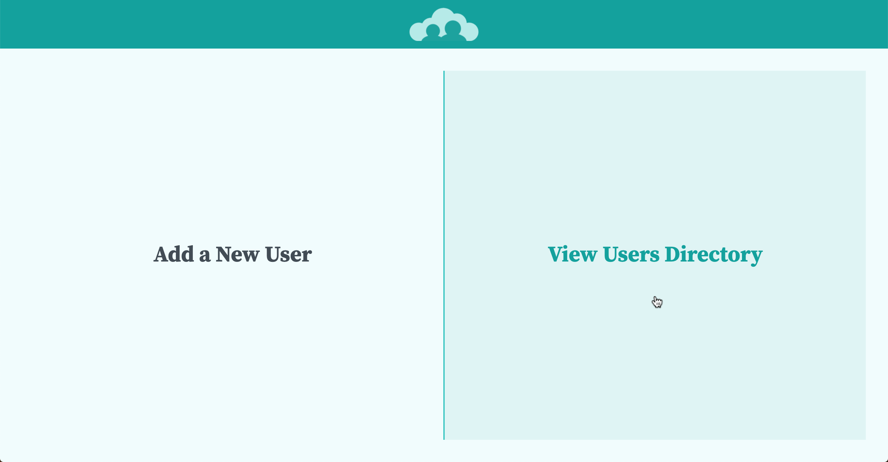
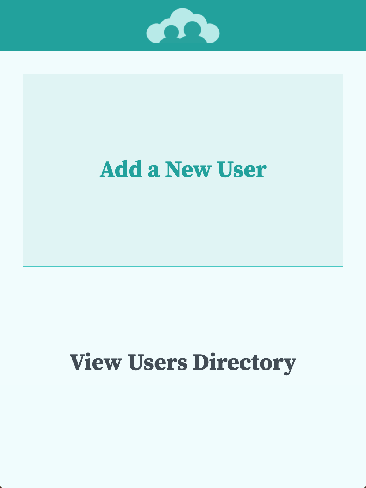

# Might As Well Jump

## I get up and nothin' gets me down

1. Run `npm install`.
2. Run `ng serve` (or `npm run start`) and visit the app at `http://localhost:4200`.
3. Run `ng test` (or `npm run test`) to execute the unit tests.

## You got it tough, I've seen the toughest around

## And I know, baby, just how you feel

## You got to roll with the punches and get to what's real

## Ah, can't you see me standin' here

## I got my back against the record machine

## I ain't the worst that you've seen

## Ah, can't you see what I mean?

## Ah, might as well jump ([jump](https://www.youtube.com/watch?v=SwYN7mTi6HM))